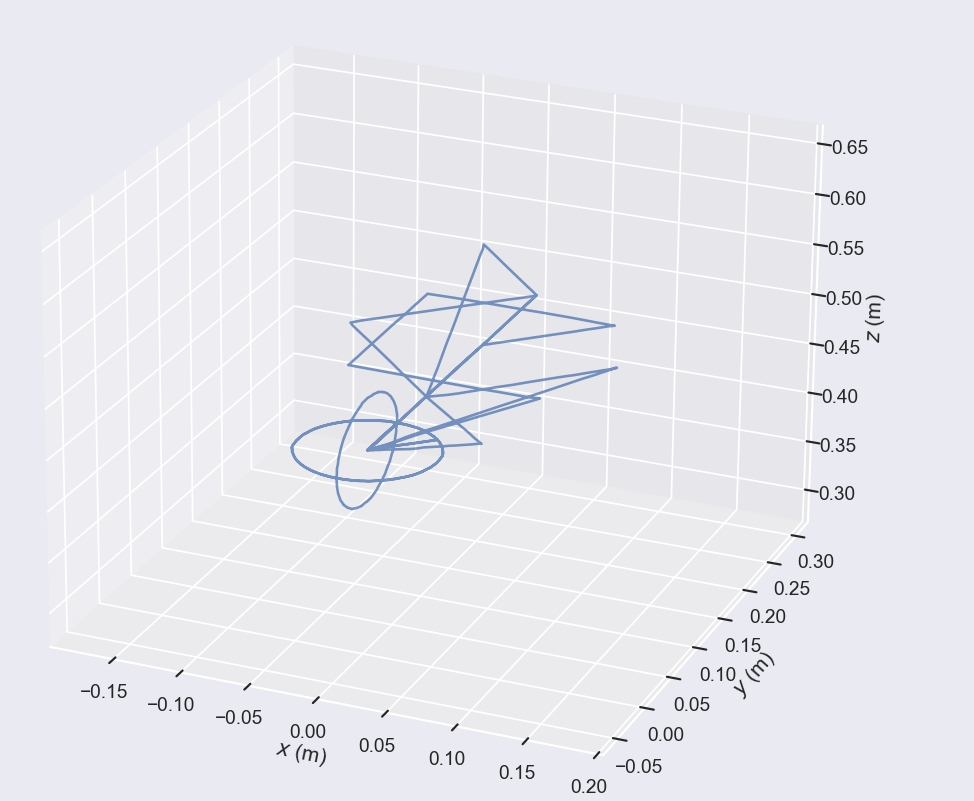

# 项目简介

本项目用于评估vio设备的位姿精度；主要方法是通过控制睿尔曼Gen72机械臂获取末端位姿作为真值，并将vio设备固定在末端获取测量值，最后使用evo对vio设备进行精度评估；

## 开始

```bash
#python 环境3.9及以上, 通过无线连接到Gen72机械臂
git clone https://github.com/CortexNest/vio_evaluation.git
pip install Robotic_Arm==1.0.1
cd vio_evaluation

# 将设备重置到一个固定初始状态
python reset_joint7.py

# 获取真值（TUM数据集格式存储）
python test.py

# 真值可视化
evo_traj tum trajectory_20250429_205104.txt -p

# [TBD] 获取测量值(TUM数据集)

# [TBD] 评估结果
# 绝对误差
evo_ape tum trajectory_20250429_205104.txt evaluation.txt -va --plot

# 相对误差
evo_rpe tum trajectory_20250429_205104.txt evaluation.txt -va --plot
```


